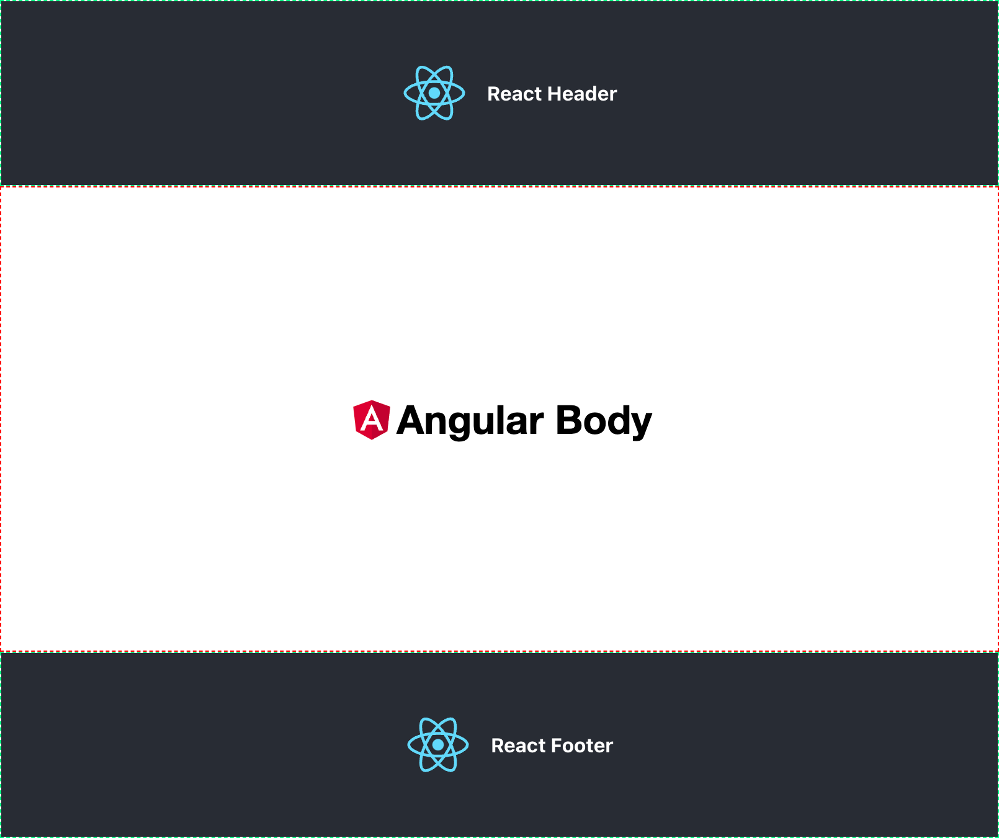

# 👋🏼 Micro Frontend with `<iframe>`!

This project demonstrates a micro frontend architecture using iframes, with an Angular application serving as the body
and two React applications serving as the header and footer.

## Getting started

1. Install the necessary packages for each application:

   *You can run `npm run install-apps` or navigate to the each directory (`angular-body`, `react-header`, `react-footer`)
     and run `npm install`.

2. Start each application:

   * For each application, navigate to its directory and run npm start.
     * `angular-body` serves as the **body** on localhost:4001.
     * `react-header` serves as the **header** on localhost:4002.
     * `react-footer` serves as the **footer** on localhost:4003.
   * Or you can server each application with these
     commands: `serve-angular-body`, `serve-react-header`, `serve-react-footer`.

3. Once all three applications are running, you can open the `app-container.html` file in your browser to see the micro
   frontends in action.

   * You can do this by running the following command from the project's root directory `npm run open`.

---

## 🌳 Directory tree

```
├── angular-body
│   ├── src
│   └── package.json
├── react-header
│   ├── src
│   └── package.json
├── react-footer
│   ├── src
│   └── package.json
├── app-container.html
└── style.css
```

Note that each application has its own `src` directory.

🚀 Enjoy your Micro Frontends!

## Final Result



License
-------

This project is licensed under the MIT License. See the `LICENSE` file for details.
