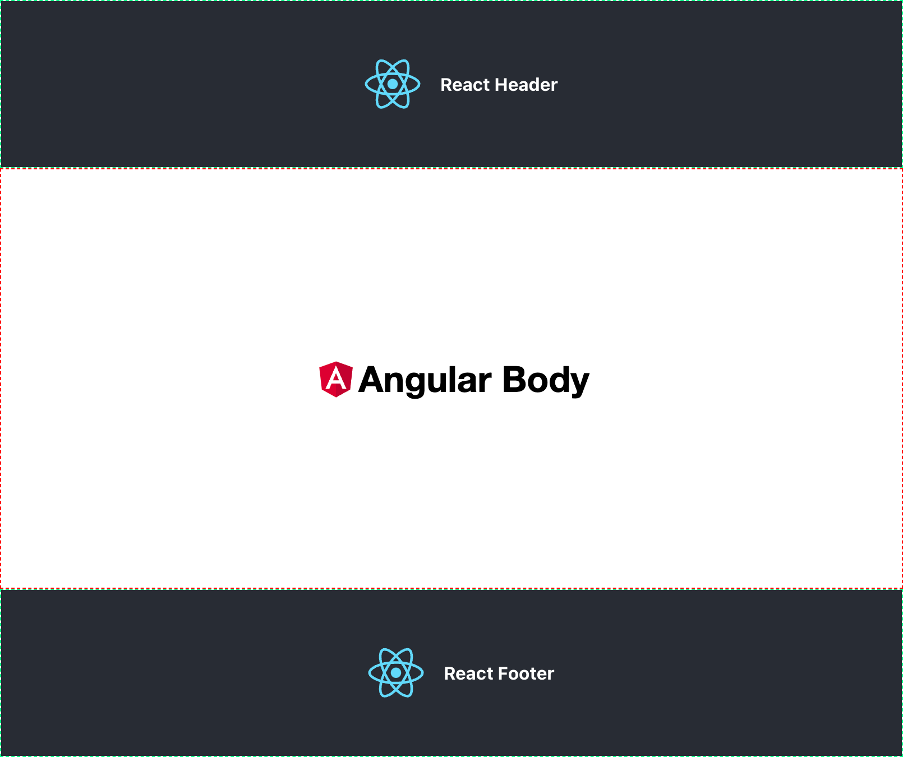

Micro Frontend with `<iframe>`
==========================

This project demonstrates a micro frontend architecture using iframes, with an Angular application serving as the body
and two React applications serving as the header and footer.

Getting Started
---------------

To run the entire architecture, you'll need to first run each application separately. Here are the steps:

1. Install the necessary packages for each application:

    - Navigate to the each directory and run `npm install` inside each project, `angular-body`, `react-header`
      and `react-footer`.
2. Start each application:

    - For `angular-body`, navigate to the directory and run `ng serve`. This will start the application
      on `localhost:3001`, which serves as the body.
    - For `react-header`, navigate to the directory and run `npm start`. This will start the application
      on `localhost:3002`, which serves as the header.
    - For `react-footer`, navigate to the directory and run `npm start`. This will start the application
      on `localhost:3003`, which serves as the footer.

3. Once all three applications are running, you can open the `app-container.html` file in your browser to see the micro
   frontends in action.

- You can do this by running the following command from the project's root directory `npm run open`.

Directory Structure
-------------------

Here's the directory tree showing only the main directories for each application:

```
├── angular-body
│   ├── src
│   └── package.json
├── react-header
│   ├── src
│   └── package.json
├── react-footer
│   ├── src
│   └── package.json
├── app-container.html
└── style.css
```

Note that each application has its own `src` directory.

Note: Before running the `open app-container.html` command, make sure to start each application with their
respective `npm` commands as explained in step 2.

## Final Result




License
-------

This project is licensed under the MIT License. See the `LICENSE` file for details.
